This project is carried our in the frame of KPP-CIP projects in 2018 and 2019. The project **KPPCIP2018 IV INNO Satellieten en bathymetrie voor monitoring kustmorfologie** proposed by  _Deltares_ has been awarded by _Rijkswaterstaat_ in November 2017.

***

[< 2020](./index.html) [ 2019](./2019.html)

# Introduction

Within this project, _Deltares_ was asked to look at available satellite images in the period 2015-2017 and explore ways to derive bathymetry from those images. Eventually Deltares provided a calibrated bathymetry for two areas of interest and compared the obtained bathymetry with _in-situ_ data collected via standard measurement methods.

# 2018

***

## Areas of interest

The two areas are both located in the North Sea area: the inlet of Ameland island in the Wadden Sea and the Western Scheldt outerdelta. These areas are characterised by active coastal morphodynamics, especially in the shallow waters. The use of remote sensing images for these areas helps to capture higher frequency dynamics, too costly and spatially confined to be fully detected by standard in-situ measurements.

<a href="assets/images/roi.png">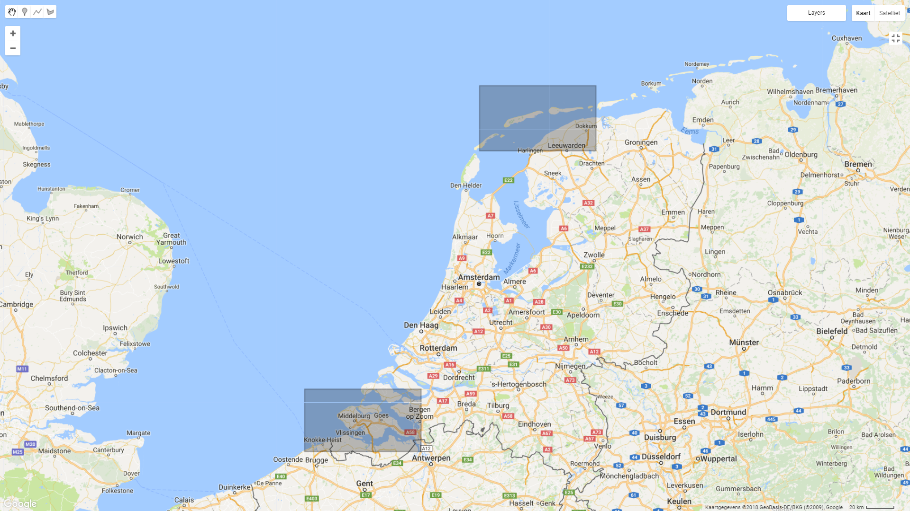</a>

## Data availability

As a rich data country, The Netherlands is monitoring its 350 km of coast at a yearly rate. For the purpose of his study, several datasets of measurement observations are explored, analysed, and compared against remote sensing products. Here is a list of data used during the project.

### In-situ data
* **[Water levels](http://matroos.deltares.nl/)**. Measurements from devices in the surroundings of the areas of interest have been downloaded from Matroos.
* **[Jarkus transects](https://github.com/openearth/jarkus)**. Profiles measured along the Dutch coast, measured on a yearly basis with singlebeam mounted on boats and lidar sensor mounted on planes. This dataset is mainly used for validation of satellite-derived products.
* **[Vaklodingen 2d map](http://opendap.deltares.nl/thredds/catalog/opendap/rijkswaterstaat/vaklodingen/catalog.html)**. Multibeam measurements performed with ships. Approximately 3 years of overpass, depending on the area. This dataset is mainly used for validation of satellite-derived products.
* **LIDAR 2d map**. Measurements from airborne mounted radar operating in the optical spectrum.

**Water levels**
[Google Earth Engine code](https://code.earthengine.google.com/e02d1005a3aac1c10d09fe85f23a8edd) which imports shapefiles of water level data, and displays the locations of the buoys and plots a subset of this data.

**Jarkus transects**

  <a href="assets/images/westerschelde_jarkus_transects.png">
  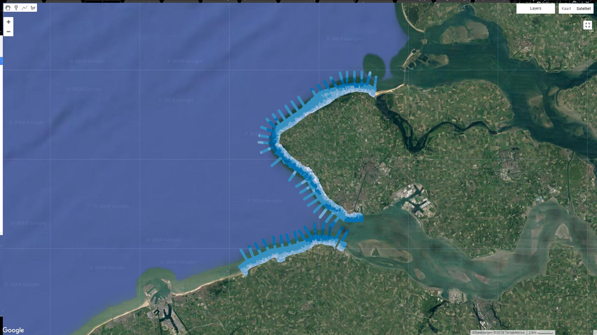</a>
  <a href="assets/images/ameland_jarkus_transects.png">
  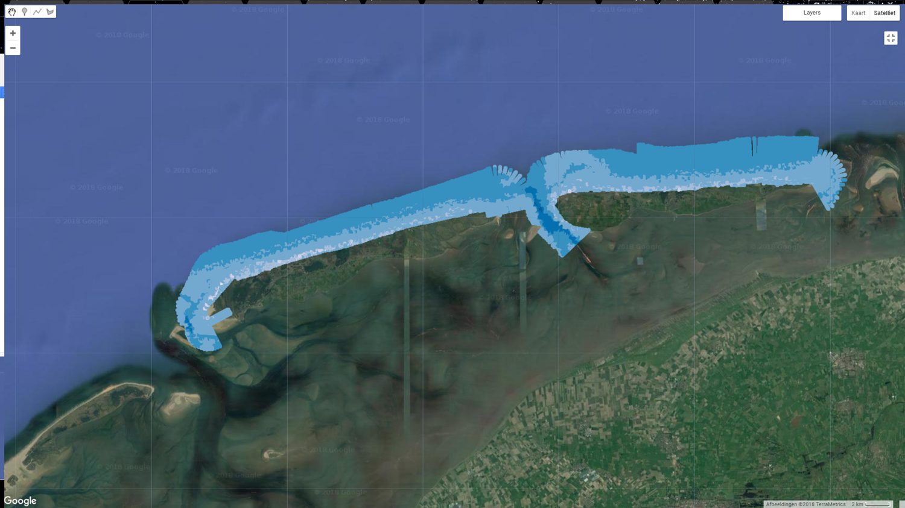</a>

 Jarkus transects for the **a)** Westerschelde and **b)** Ameland regions.

**RWS Vaklodingen Data**

  <a href="assets/images/westerschelde_rws_vaklodingen.png">
  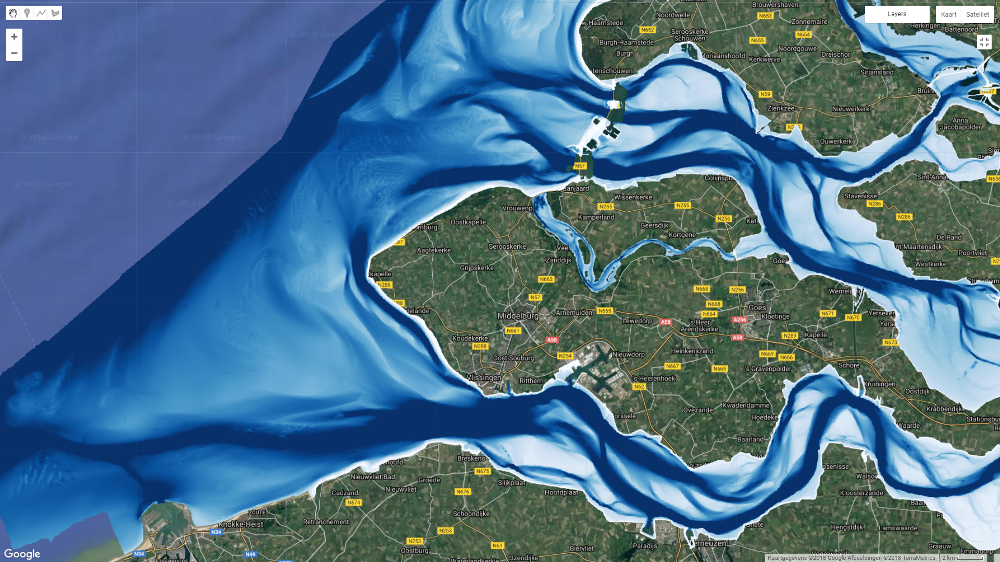</a>
  

 Vaklodingen data for the **a)** Westerschelde and **b)** Ameland regions. A total of 90 Vaklodingen images, measured annually, between 2010 and 2015 are combined to create a mosaic of bathymetry along the Dutch coastline. 

### Remote sensing data
* **Sentinel2**. European EO mission launched in 2015 (A) and 2017 (B). It provides multi-spectral data in the visible, near infrared and short wave infrared part of the spectrum.
* **LandSat8**. American EO mission launched in 2013. It provides multi-spectral images thanks to the OLI (Operational Land Imager) and Thermal InfraRed sensors.
* **TripleSat**. Commercial Satellite sensor, made available by NSO (Netherlands Space Office).
* **RapidEye**. Commercial Satellite sensor, made available by NSO (Netherlands Space Office).

  
  

Examples of cloud-free satellite imagery of **a)** the Westerchelde and **b)** Ameland. 

For this analysis, we have used Sentinel 2 and Landsat imagery up to present day. A sample of cloud-free satellite imagery from Sentinel 2 available for the regions of interest are displayed above.

### Additional data
* **Cloud coverage**. The [Global 1-km Cloud Cover](http://www.earthenv.org/cloud) map is used to determine a threshold to automatically discard cloudy images.
* **Bathymetric Products**. Processed data from a third commercial party.

## Methodology

With Google Earth Engine, images from Sentinel 2 and Landsat 8 available up to present day are used for analysis. This image collection is sorted by cloud cover, and the percentage of images filtered based on the annual cloud coverage for the regions (~66% for the Netherlands).

More information on the methodology available in [this poster](http://bit.ly/egu19-sdb), presented at EGU.

## Results

<iframe src="https://player.vimeo.com/video/273185380?loop=1&quality=1080p&autoplay=1" width="640" height="360" frameborder="0" webkitallowfullscreen mozallowfullscreen allowfullscreen></iframe>

<a href="https://vimeo.com/273185380">Bathymetry from Space, Wadenzee (2013-2018)</a> from <a href="https://vimeo.com/user18987785">Gennadii Donchyts</a> on <a href="https://vimeo.com">Vimeo</a>.

### Validation and Comparison

#### Water levels

<a href="assets/images/nes_L8_S2_overlap.png">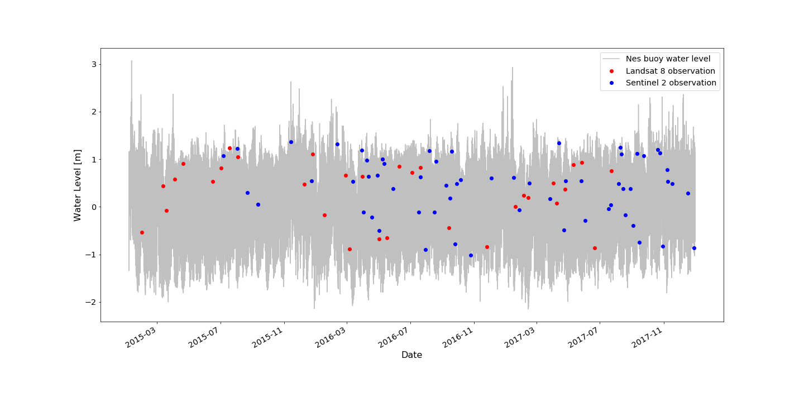</a>
Water level measurements plotted in gray have been derived from a buoy off the coast of Nes, The Netherlands (5.7609, 53.4311). Corresponding cloud-free (<15% coverage) images between 2015 to the present from Landsat 8 and Sentinel 2 are plotted in red and blue, respectively. These images were then sorted by water level from in-situ Matroos data. Location in the Netherlands, along the North Sea (6.20, 53.41). The movies below provide a visualization of the intertidal zone and waterlevel changes within Ameland region.

<iframe src="https://player.vimeo.com/video/264566972?autoplay=1&loop=1" width="640" height="360" frameborder="0" webkitallowfullscreen mozallowfullscreen allowfullscreen></iframe>

<a href="https://vimeo.com/264566972">False colour L8 and S2 sorted by water level</a> from <a href="https://vimeo.com/user83949260">Christine Rogers</a> on <a href="https://vimeo.com">Vimeo</a>.

False colour Landsat 8 and Sentinel 2 images, sorted by water levels recorded at Nes buoy.

<iframe src="https://player.vimeo.com/video/264566971?autoplay=1&loop=1" width="640" height="360" frameborder="0" webkitallowfullscreen mozallowfullscreen allowfullscreen></iframe>

<a href="https://vimeo.com/264566971">RGB L8 and S2 sorted by water level</a> from <a href="https://vimeo.com/user83949260">Christine Rogers</a> on <a href="https://vimeo.com">Vimeo</a>.

RGB Landsat 8 and Sentinel 2 images, sorted by water levels recorded at Nes buoy.

[Code](https://code.earthengine.google.com/38a551ad6f10413f5ede7daafc30c97b) which creates and exports above videos.

#### Jarkus transects

***
##### Transect 3002500

Jarkus transect #3002500 and region selected for analysis. Region centered at (5.97, 53.46).

<a href="assets/images/3002500_z_vak_invdepth_jarkus.png">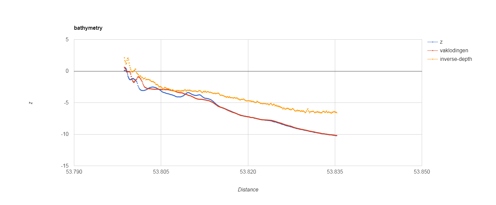</a>

Comparison of bathymetry from Jarkus transect #3002500 (z), Vaklodingen, and inverse-depth in selected region for analysis.

***
##### Transect 3000720

Jarkus transect #3000720 and region selected for analysis. Region centered at (5.68, 53.47).

<a href="assets/images/3000720_z_vak_invdepth_jarkus.png">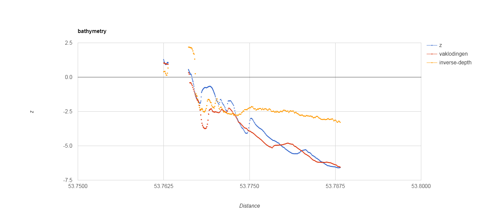</a>

Comparison of bathymetry from Jarkus transect #33000720 (z), Vaklodingen, and inverse-depth in selected region for analysis.

***
##### Transect 4005903

Jarkus transect #4005903 and region selected for analysis. Region centered at (5.16, 53.35).

<a href="assets/images/4005903_z_vak_invdepth_jarkus.png">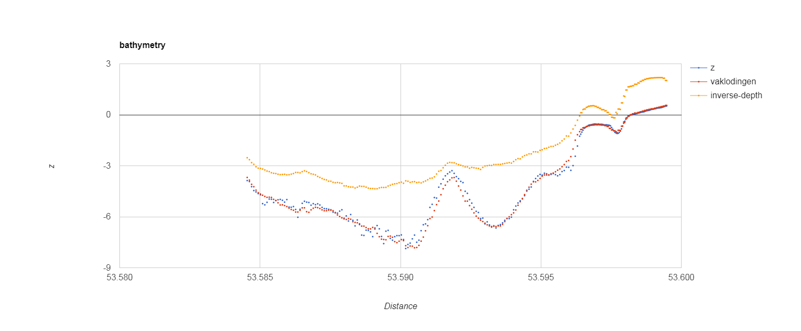</a>

Comparison of bathymetry from Jarkus transect #4005903 (z), Vaklodingen, and inverse-depth in selected region for analysis.

***
##### Transect 17000071

Jarkus transect #17000071 and region selected for analysis. Region centered at (3.56, 51.40).

<a href="assets/images/17000071_z_vak_invdepth_jarkus.png">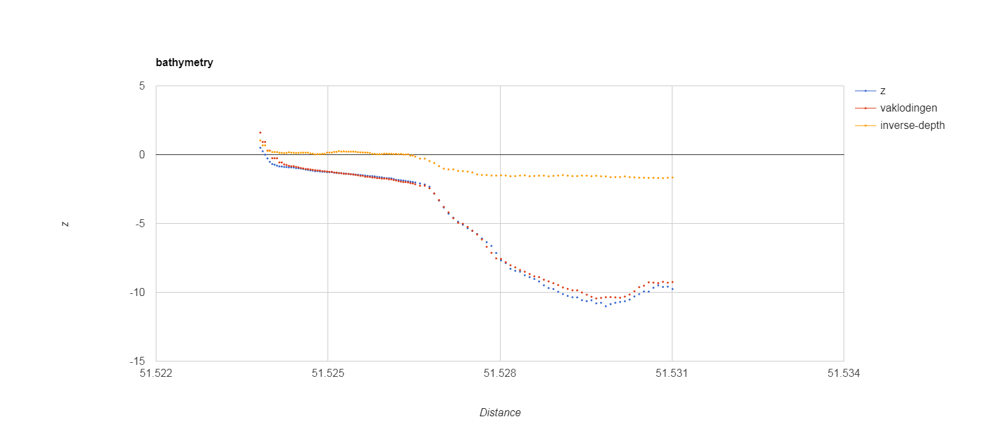</a>

Comparison of bathymetry from Jarkus transect #17000071 (z), Vaklodingen, and inverse-depth in selected region for analysis.

***
##### Transect 16001165

Jarkus transect #16001165 and region selected for analysis. Region centered at (3.53, 51.58).

Comparison of bathymetry from Jarkus transect #16001165 (z), Vaklodingen, and inverse-depth in selected region for analysis.

***

#### RWS Vaklodingen Data

  
  <a href="assets/images/westerschelde_intertidal_bathymetry_correlation_map.png">
  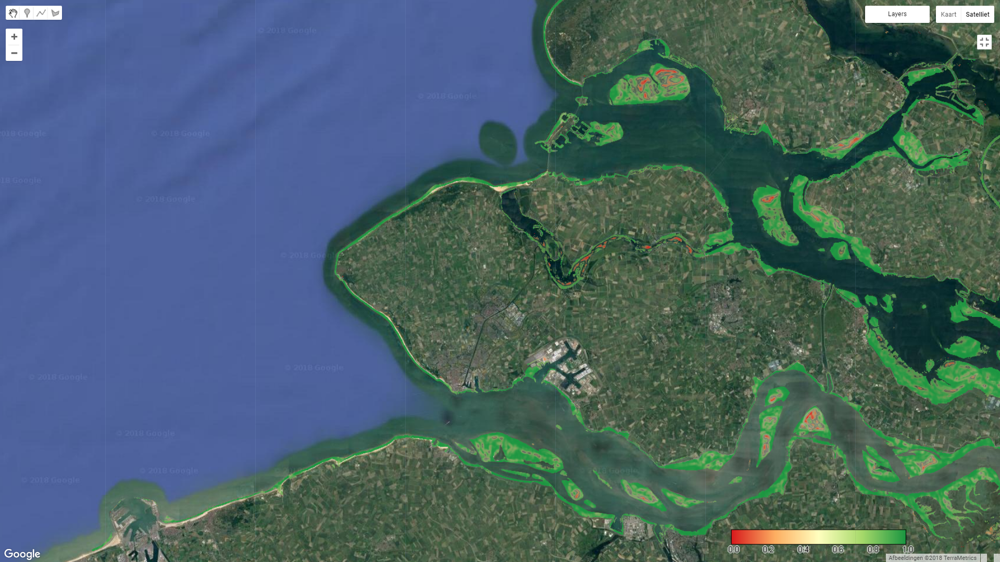</a>

On the top left a sample of the reconstructed bathymetry of the Westerschelde is pictured. On the top right shows a visual representation of the absolute correlation between the Vaklodingen and the reconstructed bathymetry in the intertidal regions. Green represents areas of high correlation, and red represents areas of lower correlation between data.

  
  <a href="assets/images/ameland_intertidal_bathymetry_correlation_map.png">
  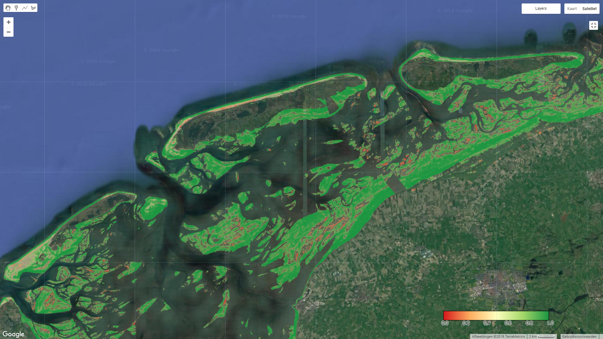</a>

<a href="assets/images/scatter_plot_randomly_sampled.png">
  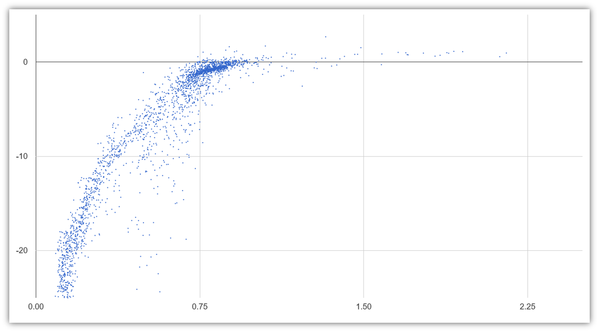</a>
<a href="assets/images/scatter_plot_high_correlation.png">
  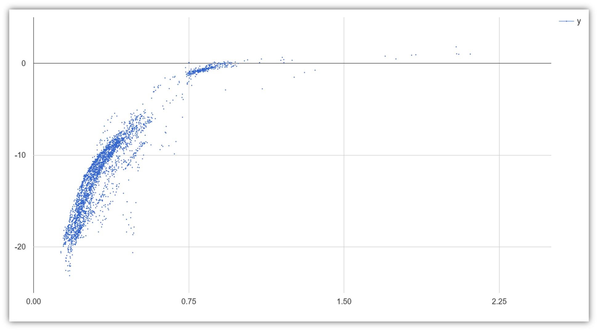</a>

On the top left a sample of the reconstructed bathymetry near Ameland is pictured. On the top right shows a visual representation of the absolute correlation between the Vaklodingen and the reconstructed bathymetry. Green represents areas of high correlation and red represents areas of lower correlation between data. On the bottom left, 5000 points within the above image were randomly sampled between the Vaklodingen and reconstructed bathymetry. This provides a relationship between the probability of water occurrence and the measured bathymetry in the region. A strong correlation exists in shallow regions for the current algorithm. On the bottom right, when points are randomly sampled accross highly correlated regions (indicated by green regions), a more evident relationship is measured in both shallow and deeper areas. Improvements to the algorithm for deeper regions is ongoing, as well as determining the best regression method for relating the reconstructed bathymetry to measured bathymetry.

A regression of
_z_ = -6.3242 _x_4 + 33.965 _x_3 - 72.483 _x_2 + 74.831 _x_ - 29.659
was found to best represent the relationship between derived water occurrence, _x_, and depth, _z_,  with a correlation coeffecient _R_2 = 0.9156.

<a href="assets/images/ameland_vaklodingen_bathymetry.gif">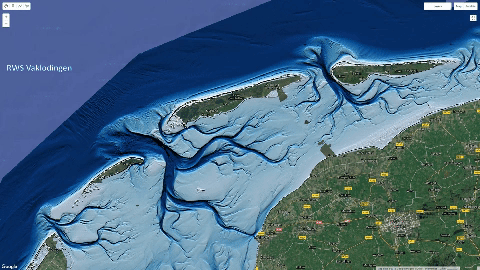</a>

Visual comparison of the Vaklodingen data and the reconstructed bathymetry from this project.

## References

[back](./)
