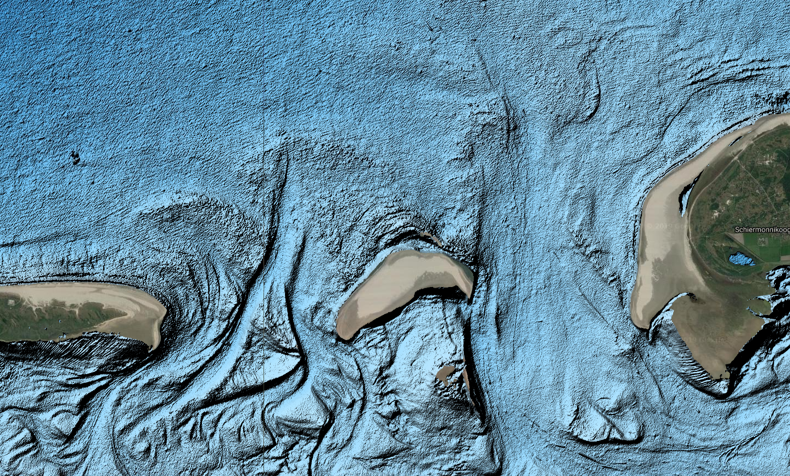
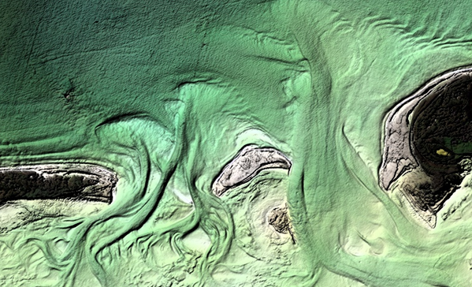

This project is carried our in the frame of KPP-CIP projects in 2018 and 2019. The project **KPPCIP2018 IV INNO Satellieten en bathymetrie voor monitoring kustmorfologie** proposed by _Deltares_ has been awarded by _Rijkswaterstaat_ in November 2017.

***

<a href="./2018.html">2018 ></a>

# Introduction

This is a continuation of research from the 2018 KPP project. Results from research in 2018 available at:
* [**2018**](./2018.html) - Within this project, _Deltares_ was asked to look at available satellite images in the period 2015-2017 and explore ways to derive bathymetry from those images. Eventually Deltares provided a calibrated bathymetry for two areas of interest and compared the obtained bathymetry with _in-situ_ data collected via standard measurement methods.

* [**2019**](#2019) -Improvements to the existing satellite derived bathymetry algorithm are explored for the Dutch coast.

***
# 2019
## Improvements to Algorithm

During 2019, the algorithm to derive SDB was improved to generate much less noise in the output data. This was achieved by introducing better spatio-temporal filtering when deriving bathymetry. Additionally, the algorithm currently uses three visible bands to estimate the water depth proxy, rather than only the green band in the 2018 algorithm. Significant improvements were achieved within the near-shore zone, where the old version of the algorithm was generating noisy water depth estimates, due to wave and bright pixels present in most of the satellite imagery.

  
  

**a)** Results using the previous version of the SDB algorithm (CIP2018). It uses four years of data (2013-2018) and the green band only. **b)** Results using the new version of the SDB algorithm (CIP2019). Uses two years of data (2015-2017) and red, green, blue band. The image is computed as a composite of water depth images estimated using visible bands separately. The final choice of the averaging should be done during the final calibration using in-situ data.

### Spectral signatures of intertidal and subtidal coastal zones

***
