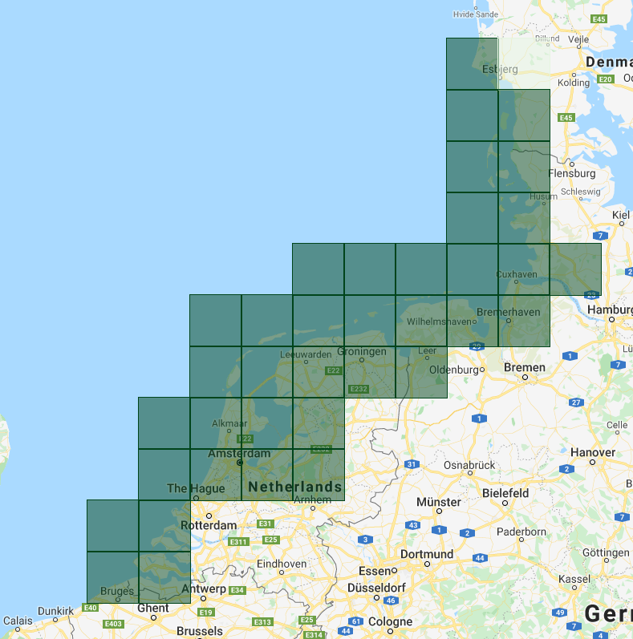

This project is carried our in the frame of KPP-CIP projects in 2018, 2019 and 2020. The project **KPPCIP IV, V en Vi Satellieten en bathymetrie voor monitoring kustmorfologie** proposed by _Deltares_ has been awarded by _Rijkswaterstaat_.

* * *

<a href="./2019.html">2019 </a> <a href="./2018.html">2018 ></a>

# Introduction

This is a continuation of research from the 2018 KPP project. Results from research in 2018 available at:
* [**2018**](./2018.html) - Within this project, _Deltares_ was asked to look at available satellite images in the period 2015-2017 and explore ways to derive bathymetry from those images. Eventually Deltares provided a calibrated bathymetry for two areas of interest and compared the obtained bathymetry with _in-situ_ data collected via standard measurement methods.

* [**2019**](#2019) - Improvements to the existing satellite derived bathymetry (SDB) algorithm are explored for the Dutch coast.

* [**2020**](#2020) - The SDB intertidal bathymetry has enriched the subtidal algorithm in 2020. Additionally, the following app has been developed for product exploration: <a href="https://gena.users.earthengine.app/view/rws-bathymetry">web app</a>.

***
# 2020

## Summary

Starting in 2015, in steps of 3 months, satellite images within a 2 year time window are used to compute depth. All Sentinel-2 and Landsat8 images within the time window are filtered for least clouds, and NDWI is used to identify water versus land. The 2 year time window is used to have sufficient images to reduce effects of clouds, waves, sediments, or other contributing noise. The darkest water pixel is subtracted per image to normalize depth proxy across images. Taking the logarithm of this results, spectral values are scaled to percentiles and unit scaled to create a depth proxy. A quality score is computed from the cumulative distribution function of each pixel. A weight is assigned to each pixel in an image based on the green band reflectance value of that pixel compared to 70th to 80th percentile of those within a 200 pixel radius. The weight of each image is used to compute a weighted mean depth proxy image across all images.

  

 Web app developed in 2020.

  

 Overview of the output tile boundaries used to export the final SDB estimates. Large squares represent SlippyMap tiles at zoom level 9 and the dark polygon defines the extent of the RWS Vaklodingen dataset.

