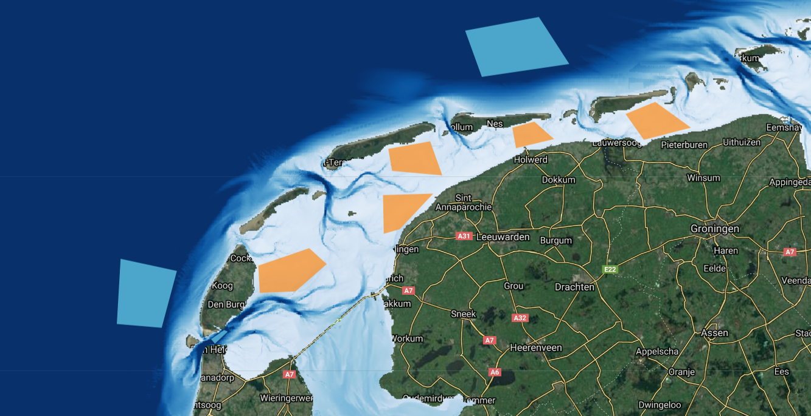
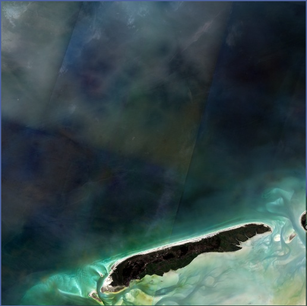
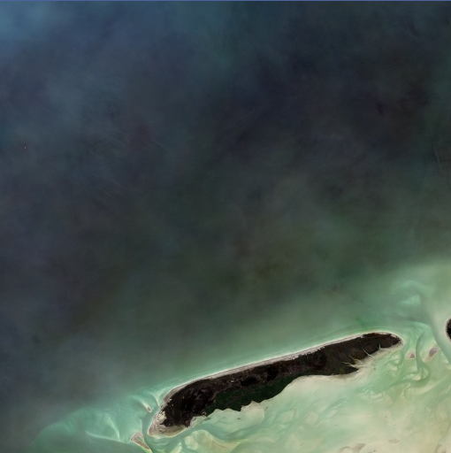
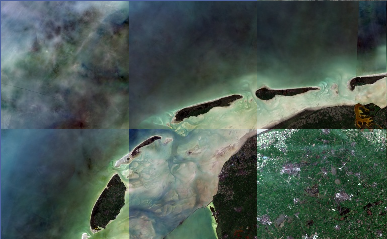

This project is carried our in the frame of KPP-CIP projects in 2018 and 2019. The project **KPPCIP2018 IV INNO Satellieten en bathymetrie voor monitoring kustmorfologie** proposed by _Deltares_ has been awarded by _Rijkswaterstaat_ in November 2017.

***

<a href="./2018.html">2018 ></a>

# Introduction

This is a continuation of research from the 2018 KPP project. Results from research in 2018 available at:
* [**2018**](./2018.html) - Within this project, _Deltares_ was asked to look at available satellite images in the period 2015-2017 and explore ways to derive bathymetry from those images. Eventually Deltares provided a calibrated bathymetry for two areas of interest and compared the obtained bathymetry with _in-situ_ data collected via standard measurement methods.

* [**2019**](#2019) - Improvements to the existing satellite derived bathymetry (SDB) algorithm are explored for the Dutch coast.

***
# 2019

## Methodology

Starting in 2015, in steps of 3 months, satellite images within a 2 year time window are used to compute depth. All Sentinel-2 and Landsat8 images within the time window are filtered for least clouds, and NDWI is used to identify water versus land. The darkest water pixel is subtracted is done per image to normalize depth proxy across images. Taking the logarithm of this results, spectral values are scaled to percentiles and unit scaled to create a depth proxy. A quality score is computed from the cumulative distribution function of each pixel. A weight is assigned to each pixel in an image based on the green band reflectance value of that pixel compared to 70th to 80th percentile of those within a 200 pixel radius. The weight of each image is used to compute a weighted mean depth proxy image across all images.

### Improvements to Algorithm

Focus of the work in 2019 has been to reduce noise in the output data. This was achieved through improved spatio-temporal filtering when deriving bathymetry. Additionally, the algorithm was expanded to use three visible bands to estimate the water depth proxy, rather than only the green band in the 2018 algorithm. Significant improvements were achieved within the near-shore zone, where the old version of the algorithm generated noise in water depth estimates from wave and bright pixels, present in most of the satellite imagery.

  
  

**a)** Results using the previous version of the SDB algorithm (CIP2018). It uses four years of data (2013-2018) and the green band only. **b)** Results using the new version of the SDB algorithm (CIP2019). Uses two years of data (2015-2017) and red, green, blue band. The image is computed as a composite of water depth images estimated using visible bands separately.

### Spectral Signatures of Intertidal and Subtidal Coastal Zones

Sampling of Sentinel-2 images between 2016-2019 was done for selected regions along the Dutch coastline to understand the effects of depth, sediments, and seabed type on the optical spectral signature. For all available cloud-free images (981 total) during this time, 200 points were sampled within deep and intertidal zones, as pictured in the figure below. This gives a broad range of statistics and preparation for applying machine learning models to derive depth.

  

 Regions selected as deep (blue) and intertidal (orange) zones for data sampling and investigation.

Red, green, and blue bands for the Sentinel-2 data show differences in reflectance between deep and intertidal zones. This demonstrates their use in computing satellite derived bathymetry, and will also provide more spectral information for dealing with varying seabed types.

  

 Differences in spectral signatures between points sampled across deep (blue) and intertidal (orange) regions. The depth of water is most distinguishable between red, green, and blue bands.

## Video Map Tiles

For an easy exploration of the SDB estimates, a map-based web tool has been created. The tool includes functionality to quickly explore the time-dependent SDB estimates using a new technology being developed at Deltares called Video Map Tiles. Video Map Tiles provide a way to convert spatio-temporal datasets into a set of tiled videos, generated at different zoom levels. The classical SlippyMap tiles, usually used to stream static map tiles, such as Google Map or OpenStreetMap, are used as a standard to host Video Map Tiles. To visualize Video Map Tiles, we have extended the Mapbox web library to support the streaming and playing of multiple video tiles with proper time synchronization.

Analysis and export of images have been done for the whole Dutch coast, and extended to other areas in the North Sea. These are at a scale of 19.109 m, corresponding to zoom level 13 of SlippyMap tile resolution.

  

 Overview of the output tile boundaries used to export the final SDB estimates. Large squares represent SlippyMap tiles at zoom level 9 and the dark polygon defines the extent of the RWS Vaklodingen dataset.

### Scene Boundary Effects

Scene boundary effects were identified, where edges of individual satellite images are visible, in an earlier version of the algorithm. These have been reduced in the current implementation by filtering images that cover >= 75% of the analysis region.

  
  

**a)** Scene boundaries visible from previous version of algorithm. **b)** Reduction of scene boundaries 

### Tile Boundary Effects

Splitting regions of evaluation into tiles corresponding with SlippyMap tile boundaries was to . Dark pixel subtraction from darkest pixel in water causes variation in results across tiles, resulting in visible tile boundaries. A different approach to normalization and analysis boundaries is required to eliminate boundary discontinuities. Future work to create a baseline of depth proxy to scale images, rather than using dark pixel subtraction for scaling, should reduce or remove these effects.

  

Boundaries visible from tile geometries.

***
