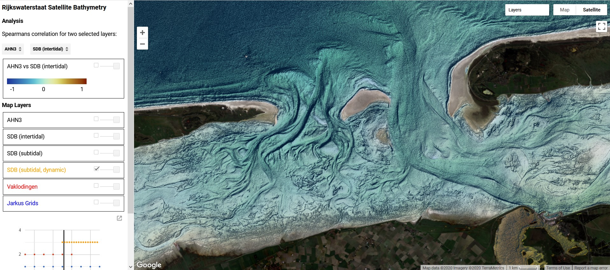

This project is carried our in the frame of KPP-CIP projects from 2018 onwards. The project **KPPCIP IV, V en Vi Satellieten en bathymetrie voor monitoring kustmorfologie** proposed by _Deltares_ has been awarded by _Rijkswaterstaat_.

* * *

<a href="./2019.html">2019 </a> <a href="./2018.html">2018 ></a>

# Introduction

This is a continuation of research from the 2018 and 2019 KPP projects. Results from research carried out in the past are available at:
* [**2018**](./2018.html) - Within this project, _Deltares_ was asked to look at available satellite images in the period 2015-2017 and explore ways to derive bathymetry from those images. Eventually Deltares provided a calibrated bathymetry for two areas of interest and compared the obtained bathymetry with _in-situ_ data collected via standard measurement methods.

* [**2019**](#./2019.html) - Improvements to the existing satellite derived bathymetry (SDB) algorithm are explored for the Dutch coast.

* [**2020 onwards**](#2020) - The SDB intertidal bathymetry has enriched the subtidal algorithm from 2020 onwards. Additionally, the following app has been developed for product exploration: <a href="https://jaapel.users.earthengine.app/view/satellite-derived-bathymetry-nl">web app</a>.

 

  

 Web app developed in 2020.

***
# 2020 onwards

## Summary

From 2020, the estimation of intertidal bathymetry has been cleaned and the overall code has improved. Subsequently the algorithm for subtidal and intertidal bathymetry are brought together in Google Earth Engine. Bathymetric data such as Vaklodingen and Jarkus Grids and topographic data such as AHN3 are great sources of available in-situ data along Dutch the coast. Deltares built a <a href="https://jaapel.users.earthengine.app/view/satellite-derived-bathymetry-nl">web app</a> open and free to use, as first version of an interactive tool for data exploration. The app consists of a Google based web map and a panel with controls. A user of the app can choose among different datasets of SDB and in-situ measurements. A time slider and a graph help to browse through the data, which and at the same time populates the map component of the app. Furthermore, the panel let the user compare different dataset and, by clicking on the map a graph is generated on the fly showing the comparison for data within the surrounding area. 

  

 Spearmans correlation and interactive panel in the web app.

